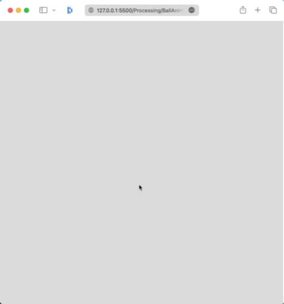

# Challenge 7 - Bouncing ball simulation

## Instructions

1. Clone the repository to your local machine.
2. Open the file `index.html` in your browser.

## Description

This program shows 3 stages or scenes that will be transitioned by a mouse right-click. The animation considers concepts like:
gravity, refresh-rate, object deformation, timing, real-time animation, curves drawing algorithms, color, ...
Below are the 3 stages or scenes of the program:

- **Click 1**
    - The ball's trajectory is drawn using parabollic bezier curves.

- **Click 2**
    - A storyboard is shown. Only some selected frames are drawn to provide a glimpse of the animation.

- **Click 3**
    - Runs the ball-bouncing simulation. The ball follows the pre-defined curved trajectories. The ball will be deformed as it's going up or down.

## Preview

