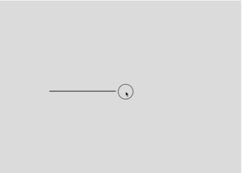

# Challenge 6 - Bezier Curves

## Instructions

1. Clone the repository to your local machine.
2. Open the file `index.html` in your browser.

## Description

- **First**, draw a line with the mouse.
    - Click and drag.

- **Second**, place (with mouse clicks) your control points.
    - Once your control points are defined, the previous created line will be removed and the curve defined by your control points will be drawn.

- **Third**, move your control points (with the mouse)

## Preview

