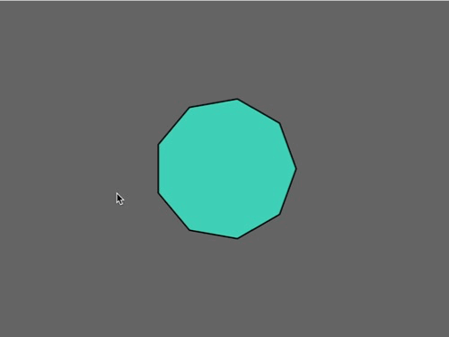

# Challenge 4 - Drawing Polygons

## Instructions

1. Clone the repository to your local machine.
2. Open the file `index.html` in your browser.

## Description

- **First** the program will start drawing a random-color filled pentagon (5 sides).
- **Then**, for every mouse click, the polygon will increase its sides by one and it will be filled with a new random color
- **Lastly**, the maximun number of sides is 12
    - Once the program has reached the maximum number of sides, it will go back to five.

## Preview

