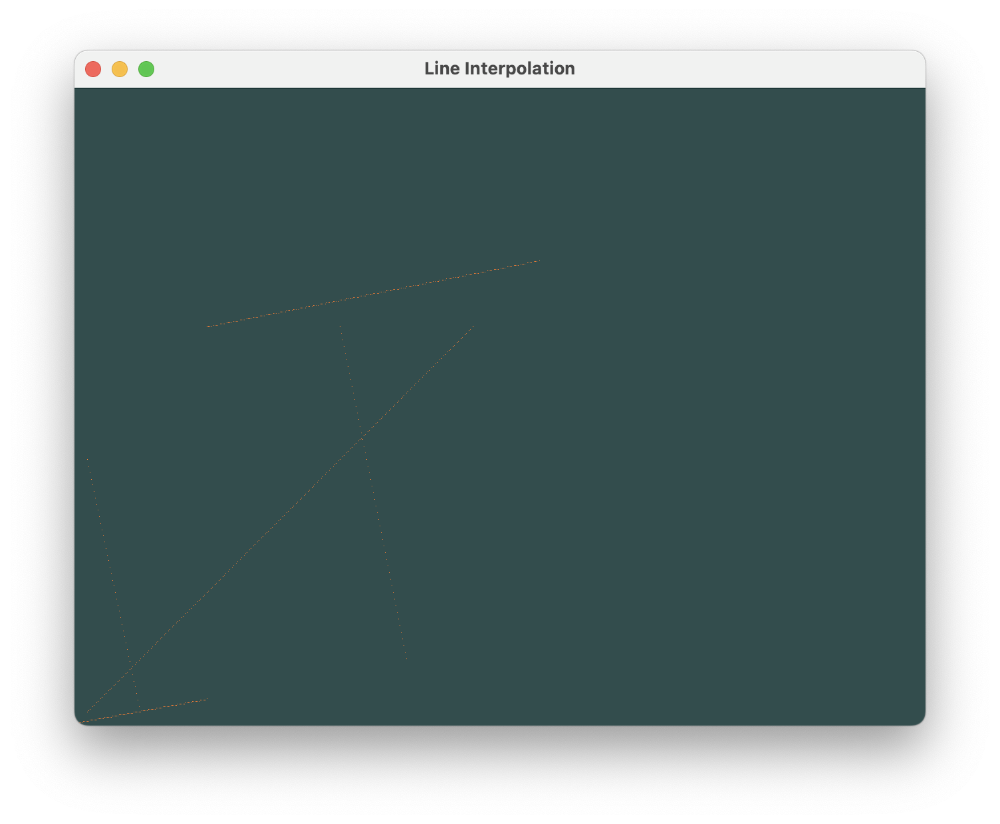

# Challenges 1 to 3 - Linear Interpolation

## Instructions

**Disclaimer:** This code has only been ran on macOS. Some changes might be neccesary for other platforms.

1. Clone the repository to your local machine.
2. Compile the code for your machine. Example: ( tested on an m1 MBA ).
 ```g++ -std=c++20 -g -I ../../dependencies/include -L ../../dependencies/library ../../dependencies/library/libglfw.3.3.dylib ./*.cpp ../../dependencies/include/glad/glad.c -o ./app -framework OpenGL -framework IOKit -framework CoreVideo -framework CoreFoundation```

## Description

- **First**, the program generates a list of points that trace a line between 2 given points on a plane.
    - The program runs five test cases.
- **Then**, the program generates a window on your machine.
- **Lastly**, the program draws the points on a canvas.

## Preview

