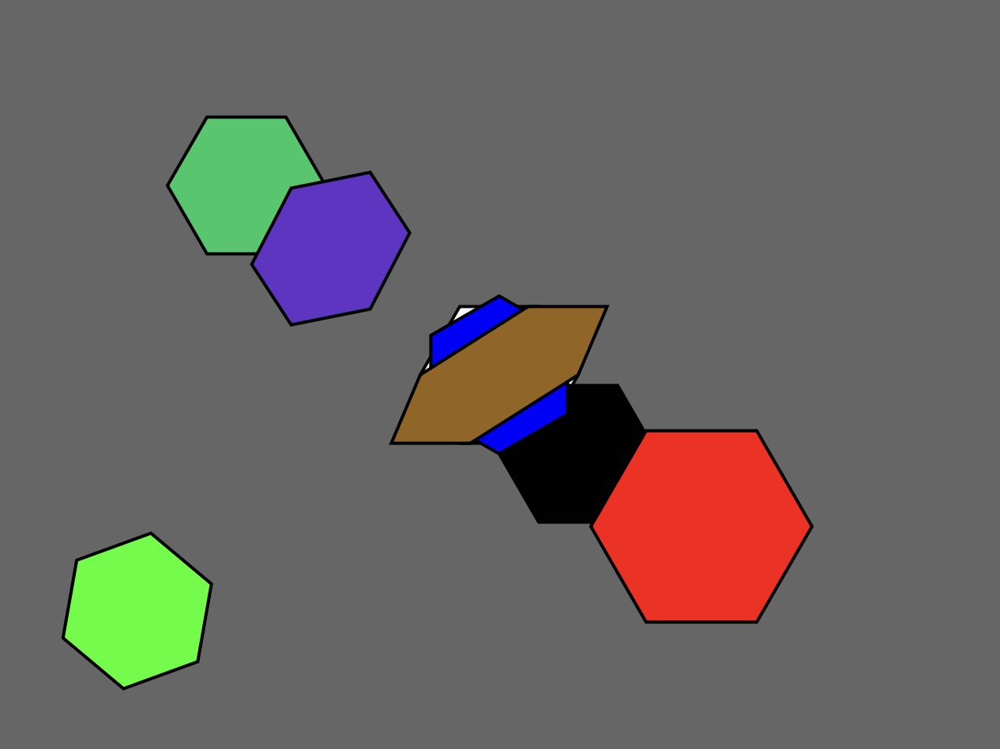

# Challenge 5 - Polygon Transformations

## Instructions

1. Clone the repository to your local machine.
2. Open the file `index.html` in your browser.

## Description

- **First**, the program has my own implementation of a couple of polygon transformation functions.
- **Then**, the program draws some transformed polygons on a canvas to showcase the functions.

## Preview

